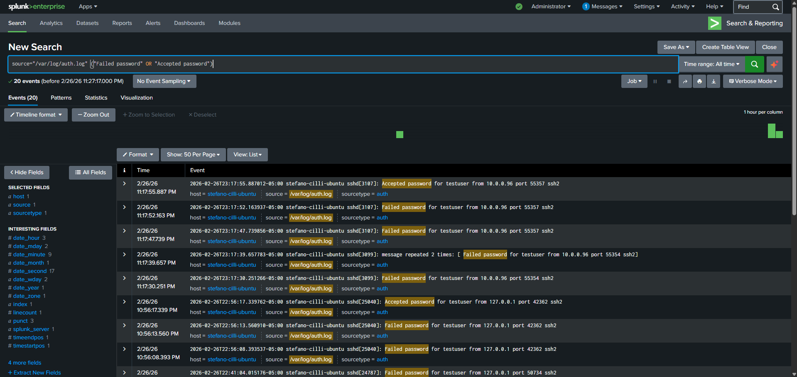
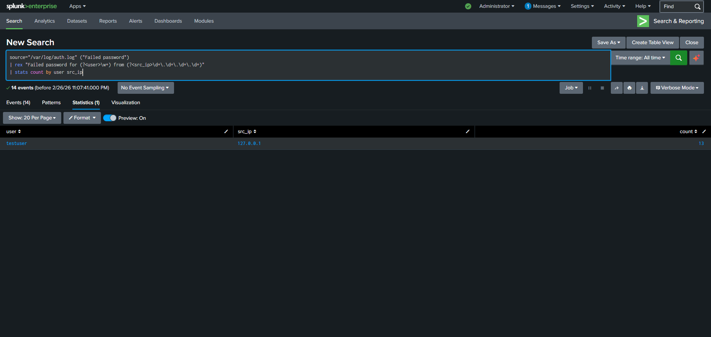
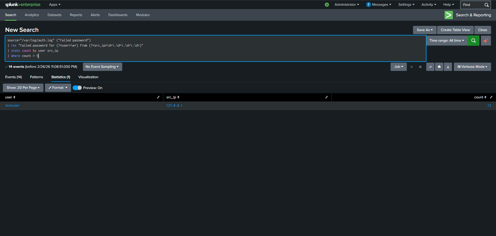
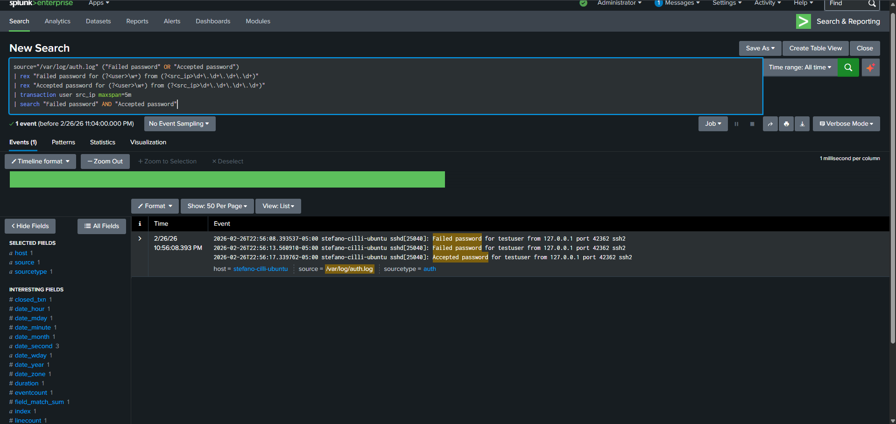

# SSH Brute-Force Detection & SIEM Analysis

## 1. Executive Summary
In this project, I simulated a real-world brute-force attack on a Linux environment and used **Splunk Enterprise** to ingest, parse, and analyze the resulting security telemetry. I successfully identified a "Low and Slow" attack pattern where multiple failed login attempts were followed by a successful compromise.

---

## 2. Environment Architecture
* **Endpoint (Machine_01):** A Linux Ubuntu instance acting as the target of the attack.
* **SIEM (Machine_02):** A Windows instance running Splunk Enterprise for centralized log analysis.
* **Data Pipeline:** Configured a Splunk Universal Forwarder on the Linux machine to stream /var/log/auth.log data to the SIEM in real-time.

---

## 3. Phase I: Attack Simulation
To generate high-fidelity security data, I performed the following actions on Machine_01:
* **User Provisioning:** Created a test account named testuser.
* **Brute-Force Execution:** Ran `ssh testuser@localhost` and intentionally entered incorrect passwords.
* **Stealth:** Spaced out the attempts to mimic real-world attacker behavior.
* **Successful Exploitation:** After generating a series of failed attempts, I entered the correct password to simulate a successful account takeover.

---

## 4. Phase II: Detection & SPL Analysis

### A. Raw Log Ingestion
I began by verifying that the logs were being forwarded correctly and filtered for specific SSH activity.

**Query:** `source="/var/log/auth.log" ("Failed password" OR "Accepted password")`

### B. Field Extraction (Regex)
Because the raw logs were unstructured, I used the `rex` command to extract the Username and Source IP into searchable fields.

**Query:** `| rex "Failed password for (?<user>\w+) from (?<src_ip>\d+\.\d+\.\d+\.\d+)"`

### C. Statistical Analysis
I quantified the volume of failed attempts per user and source IP to identify the most aggressive attackers.

**Observation:** Found 13 failed attempts from the loopback address 127.0.0.1 targeting testuser.

---

## 5. Phase III: Correlation & Pattern Recognition
By using the `transaction` command, I correlated the "Failed" events with "Accepted" events within a 5-minute window to identify successful compromises.

**Key Finding:** I identified a pattern where 4 failed passwords from 10.0.0.96 were immediately followed by an Accepted password for testuser, confirming a successful brute-force breach.

.png)

---

## 6. Cybersecurity Skills Demonstrated
* **Log Forwarding:** Configured Universal Forwarders to centralize Linux auth.log data.
* **SIEM Engineering:** Built custom SPL queries to transform raw text into actionable intelligence.
* **Threat Hunting:** Identified the exact point of system compromise by correlating failed and successful login events.
